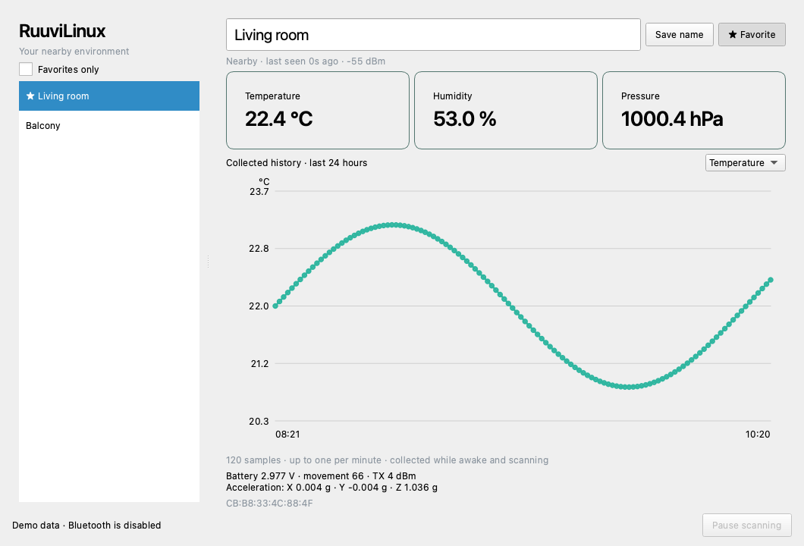

# RuuviLinux

An independent, open-source **native Qt desktop app** for RuuviTags on Omarchy / Arch Linux. Sister project: [RuuviMac](https://github.com/tonibergholm/RuuviMac).



*Generated-data demo rendered on Omarchy / Hyprland with its native Qt theme.*

## MVP features

- Live BLE discovery using Bleak's BlueZ D-Bus backend. No pairing, Ruuvi account, internet connection, or Gateway needed during use.
- Temperature, humidity, pressure, voltage, acceleration, movement count, TX power, and signal strength.
- Saved device names and favorites, favorite filter, and stale-reading indicator.
- Persistent SQLite history, up to one sample per minute and 14,400 samples per tag. Temperature, humidity, and pressure charts show the last 24 hours or 10 days, with gaps for missing data / long outages.
- Pause / resume scanning, actionable Bluetooth error messages, safe asynchronous shutdown.
- Native desktop launcher for Omarchy's **Super + Space** menu.
- Demo mode with generated data; demo never accesses your sensor database or Bluetooth.

Supports **RuuviTag RAWv2 / format 5** only in v0.3. Ruuvi Air, legacy formats, cloud sync, alerts, firmware updates are outside this release.

## Install on Omarchy / Arch

Requires Python 3.11+, BlueZ 5.55+, a Bluetooth LE adapter, and a running graphical desktop. Dependencies download from PyPI at installation. The native Qt interface supports Wayland (Hyprland) and X11; no browser or web server is involved.

```sh
sudo pacman -S --needed git python uv bluez bluez-utils
sudo systemctl enable --now bluetooth.service
bluetoothctl power on

git clone https://github.com/tonibergholm/RuuviLinux.git
cd RuuviLinux
./scripts/install-omarchy.sh
```

Open **RuuviLinux** from Super + Space, or run `~/.local/bin/ruuvilinux`. Bring a RAWv2 RuuviTag nearby; it appears automatically. Edit a name and press Enter or Save name; use Favorite to save it in the favorite list.

The installer creates an isolated Python environment under `${XDG_DATA_HOME:-~/.local/share}/ruuvilinux/venv`, a launcher under `~/.local/bin`, a desktop entry, and an icon. It does not change Hyprland configuration, enable background services for the app, or run Bluetooth scanning as root. Re-run the installer after pulling updates.

If the Wayland Qt plugin cannot load, check missing shared-library messages; install the matching desktop runtime dependencies. `QT_QPA_PLATFORM=xcb ~/.local/bin/ruuvilinux` is a fallback when XWayland is available (Arch may also need `libxcb`, `xcb-util-cursor`, and `libxkbcommon-x11`). Prefer the default native Wayland backend on Hyprland.

## Run from source / try the demo

```sh
uv venv --python python3
uv pip install --python .venv/bin/python -e '.[dev]'
.venv/bin/ruuvilinux
.venv/bin/ruuvilinux --demo
.venv/bin/ruuvilinux --adapter hci1
```

`--adapter` selects a Linux adapter if multiple are installed. This project targets Linux; demo / test mode can also run on macOS for development. Use RuuviMac for supported macOS BLE operation.

## MQTT input (v0.2)

Open **MQTT settings** to enter your broker hostname, port, topic filter, optional username/password, and TLS setting. Connect MQTT switches from Bluetooth to the broker; **Use Bluetooth** switches back. MQTT reconnects automatically during the session. The app starts with Bluetooth on the next launch. Non-secret connection settings are saved; the password remains in memory for this session only.

Use port 1883 for plain MQTT or your broker's TLS port (commonly 8883), and enable TLS for the latter. TLS verifies the broker certificate using system trust; self-signed certificates need to be trusted by the operating system. Enter a hostname rather than a URL. The default topic filter is `ruuvi/#`; change it to match your publisher, for example `ruuvibridge/#`.

Supported input is MQTT 3.1.1 JSON from:

- [Ruuvi Gateway](https://docs.ruuvi.com/ruuvi-gateway-firmware/data-formats/mqtt-time-stamped-data-from-bluetooth-sensors): `data` advertisement hex, `ts` UNIX seconds, and `rssi`; `gwts` is a fallback timestamp.
- [ruuvi-go-gateway](https://github.com/Scrin/ruuvi-go-gateway): the same raw Gateway fields.
- [RuuviBridge](https://github.com/Scrin/RuuviBridge): `data_format: 5`, `mac`, `timestamp` UNIX seconds, `rssi`, and decoded sensor fields. Bridge pressure in Pa is converted to hPa; voltage remains V and acceleration remains g.

Only RAWv2 / format 5 readings with a valid source UNIX timestamp and RSSI are accepted. Configure Gateway timestamped publishing; its untimestamped mode is ignored. Status messages and malformed packets are ignored. Retained messages keep their source timestamps; duplicates and older messages cannot overwrite fresher readings. The sensor MAC shares names, favorites, and history with Bluetooth readings. History is collected as messages arrive, at most once per minute, without downloading older broker history. Tag-memory download is a separate Bluetooth action. This is a subscriber; configure your existing Gateway/Bridge to publish to the broker separately.

Linux also accepts `--mqtt-host`, `--mqtt-port`, `--mqtt-topic`, `--mqtt-username`, and `--mqtt-tls`. For CLI use, supply the session password through `RUUVILINUX_MQTT_PASSWORD`.

```sh
ruuvilinux --mqtt-host broker.example.com --mqtt-port 8883 --mqtt-tls --mqtt-topic 'ruuvi/#'
```

## Download stored RuuviTag history (v0.3)

Select a sensor and press **Download tag history**. Bring the tag into Bluetooth range, and close any other app holding a connection to it. The app temporarily connects through Nordic UART Service, reads temperature, humidity and pressure, then disconnects. Its regular Bluetooth scanning resumes afterward; MQTT subscriptions can remain active. **Cancel history download** stops the operation. The chart switches to **Last 10 days**.

Standard RuuviTag firmware stores about 10 days at five-minute intervals ([official product information](https://ruuvi.com/ruuvitag/)). The request follows the [official log-read protocol](https://docs.ruuvi.com/communication/bluetooth-connection/nordic-uart-service-nus/log-read): environmental endpoint `0x3A`, current UNIX time and lower-bound time, followed by timestamped values and an explicit end marker. The computer clock anchors the tag's relative sample ages, so keep it accurate. Pressure is converted from Pa to hPa; negative temperatures are signed.

History is kept for 10 days, up to 14,400 samples per tag. Live and downloaded samples in the same UNIX minute merge; existing measurements take precedence, missing fields are filled, and repeated downloads do not add another sample in the same minute. Imports preserve names, favorites, the latest live reading and last-seen time. On cancellation or failure, received samples are retained with a visible partial-result message; retrying fills what is still missing.

This needs connectable firmware with logging support. Longlife firmware may not store history, and a broadcast-only tag cannot accept a connection. Connection failures explain Bluetooth power, range, firmware and other active tag connections. Ruuvi Air history and firmware changes are outside this release. History download is local to each app; the two computers do not synchronize databases with each other. MQTT alone cannot fetch a tag's onboard log.

## History and storage

Data lives in `${XDG_DATA_HOME:-~/.local/share}/ruuvilinux/sensors.sqlite3`. Names, favorites, latest readings, and collected history are committed in SQLite transactions. Use `--database /path/to/sensors.sqlite3` to choose another location. Quit the app before copying / moving its database.

History contains measurements observed while the app is running and awake: local receipt timestamps for Bluetooth, publisher UNIX timestamps for MQTT. Repeat measurement sequences are skipped; samples are spaced by at least one minute. History older than 10 days is pruned on incoming readings and filtered out of charts immediately. A sleeping computer or paused app cannot collect data, and tag-history download can fill past readings from compatible firmware. Previously saved sensors stay visible after relaunch; readings become stale after 30 seconds without an advertisement. Identity uses the RAWv2 MAC, falling back to the BlueZ device address if unavailable.

## Bluetooth troubleshooting

- Check `systemctl status bluetooth.service`, `bluetoothctl show`, and `rfkill list bluetooth`. If blocked, enable Bluetooth in your desktop controls or use `rfkill unblock bluetooth` as appropriate.
- If the app shows a BlueZ NotReady / adapter error, turn Bluetooth on and press Resume scanning. After an adapter power cycle or BlueZ restart, pause/resume scanning to re-establish discovery.
- A D-Bus access error should be resolved through the distribution's BlueZ / session permissions. Run the app as your normal logged-in desktop user; it does not require raw HCI socket capabilities or root.
- Tags broadcasting formats other than 5 are ignored. Compare the tag's mode and readings with Ruuvi Station.
- SQLite storage errors are displayed. If the database is corrupt, quit and move it aside to start fresh; preserve it first if you need its data.

## Tests and validation

```sh
.venv/bin/python -m pytest -q
QT_QPA_PLATFORM=offscreen .venv/bin/ruuvilinux --smoke-test --screenshot /tmp/ruuvilinux-demo.png
.venv/bin/python -m build
```

Tests cover official protocol vectors and unavailable values, every truncated payload length, wrong manufacturers / unsupported formats, history deduplication / retention, name and favorite persistence, XDG paths, failed scanner startup / shutdown, advertisement dispatch, and GUI interactions. MQTT tests cover raw/Bridge messages, timestamps, authentication/TLS setup and subscription rejection. Set `RUUVILINUX_MQTT_TEST_PORT=18884` with a local broker on 127.0.0.1 to include real broker/GUI ingestion; otherwise that test is skipped. GitHub Actions includes this broker test on Ubuntu Linux.

Real RAWv2 discovery and local history have also been verified on an Omarchy / Hyprland machine. See `VALIDATION.md` for exact coverage and remaining checks. Hardware smoke test on Omarchy: discover a real RAWv2 tag, compare readings with Ruuvi Station, rename/favorite, wait for minute samples, relaunch, pause/resume, move out of range, turn Bluetooth off/on, and close while scanning.

## Protocol and library research

- [Official Ruuvi RAWv2 specification](https://docs.ruuvi.com/communication/bluetooth-advertisements/data-format-5-rawv2): this small Python decoder implements the documented wire format and is tested against its published valid, minimum, maximum, and unavailable vectors. Ruuvi's Swift BTKit is used in the Mac sibling; it is not a Linux Python dependency.
- [Official Ruuvi BTKit](https://github.com/ruuvi/BTKit) and [Bluetooth connection protocols](https://docs.ruuvi.com/communication/bluetooth-connection): references for sensor-memory transfers. No Ruuvi library code or logos are copied here.
- [Bleak scanner API](https://bleak.readthedocs.io/en/latest/api/scanner.html) / [Linux backend](https://bleak.readthedocs.io/en/latest/backends/linux.html): BlueZ D-Bus discovery, manufacturer data keyed by company ID. Bleak strips company bytes; `manufacturer_data[0x0499]` is the payload, unlike the Mac CoreBluetooth field.
- [Omarchy](https://omarchy.org/) / [GUI manual](https://omarchy.org/manual/guis/): desktop launcher integration uses a regular freedesktop entry, with no changes to the user's desktop setup.
- [Official Ruuvi Cloud API](https://github.com/ruuvi/ruuvi.cloudapi.yaml): cloud support is deferred; this MVP stays local.

## Licensing

Project code is MIT (`LICENSE`). The original SVG application icon is included under the same license. Bleak is MIT. Eclipse Paho MQTT is dual licensed EPL-2.0 / EDL-1.0 and remains under its upstream terms. PySide6 / Qt remain under their own [Qt for Python licensing terms](https://doc.qt.io/qtforpython-6/licenses.html), including LGPLv3 / GPLv3 / commercial options; installing this source app does not relicense them. This app uses QtCore, QtGui, and QtWidgets via PySide6-Essentials and does not use Qt Charts. If redistributing bundled runtime libraries, preserve notices and meet applicable license obligations. Ruuvi and Omarchy trademarks belong to their owners. This project is independent and is not an official Ruuvi or Omarchy product.
